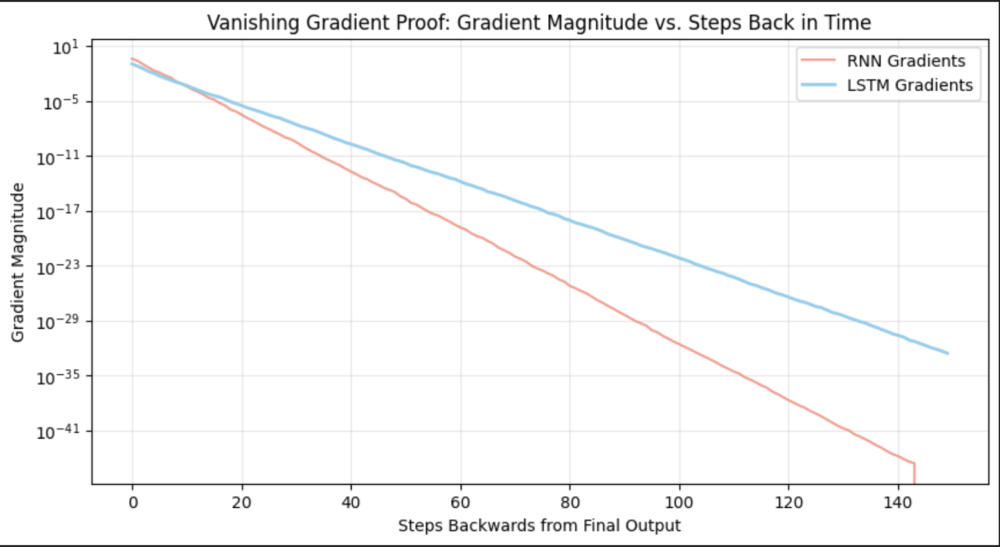
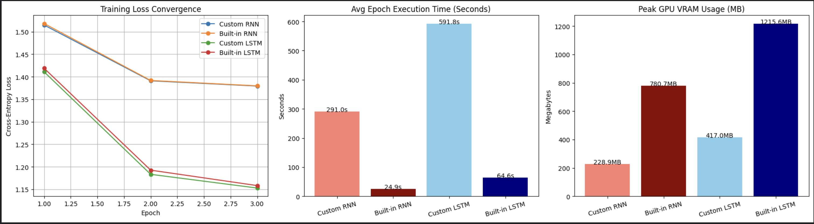

# LSTM Under The Hood: Benchmarking Recurrent Architectures

An engineering deep-dive into Recurrent Neural Networks (RNNs) and Long Short-Term Memory (LSTM) networks. This project implements sequential neural networks from scratch using PyTorch primitives (`nn.Linear`) and benchmarks them against native PyTorch C++/CUDA implementations.

## 🚀 Project Overview

The goal of this project was to move beyond simply using deep learning APIs and instead mechanically prove *why* LSTMs were invented and *why* modern deep learning frameworks are necessary for performance. 

Trained on the **Tiny Shakespeare** dataset with an extended sequence length (`SEQ_LEN = 300`), this project tests four distinct architectures:
1. **Custom RNN:** Hand-coded sequential Python loop using `nn.Linear`.
2. **Built-in RNN:** PyTorch's native `nn.RNN` utilizing fused cuDNN backends.
3. **Custom LSTM:** Hand-coded gating mechanisms (Input, Forget, Cell, Output).
4. **Built-in LSTM:** PyTorch's native `nn.LSTM`.

---

## 📊 Key Discoveries & Benchmarks

### 1. The Vanishing Gradient Proof
By extracting the gradient magnitudes of a 150-step sequence with respect to the initial time step, we mathematically visualized the **Vanishing Gradient Problem**. 

* **Vanilla RNN:** Gradients decay exponentially to zero, completely destroying the network's ability to learn long-term dependencies.
* **LSTM:** The additive cell-state and forget gates successfully preserve the gradient magnitude horizontally across the entire sequence.

### 2. Execution Overhead & Fused Kernels
Manually stepping through temporal sequence loops in Python creates massive I/O overhead. Benchmarking revealed the massive performance gap between manual unrolled loops and framework-level C++ optimizations.

* **Custom LSTM** took roughly **~2.5x longer** per epoch compared to the **Built-in LSTM**.
* The Custom RNN converged similarly to the Built-in RNN, proving the mathematical validity of the custom implementation, despite the speed handicap.

---

## 🎭 Text Generation Validation
After training, all four models were prompted with `"O Romeo, Romeo!\n"` to validate character-level language generation. 

While the **RNNs** devolved into gibberish and failed to hold structural context, the **LSTMs** successfully learned Shakespearean formatting, consistently generating accurate character names and line breaks:

> **MODEL: BUILT-IN LSTM**
> O Romeo, Romeo!
> 
> AUFIDIUS:
> Besingly shall do I think, so, then
> Will you go in war from where he wounded,
> And save a traitor, to entercesish'd!
> 
> CORIOLANUS:
> She kings, servilt is blow of mean.

---

## ⚙️ Reproduction Guide
1. Clone the repository: `git clone https://github.com/yourusername/lstm-benchmarking.git`
2. Install dependencies: `pip install -r requirements.txt`
3. Run the complete training, benchmarking, and plotting pipeline via the provided Jupyter Notebook in the `notebook/` directory.
